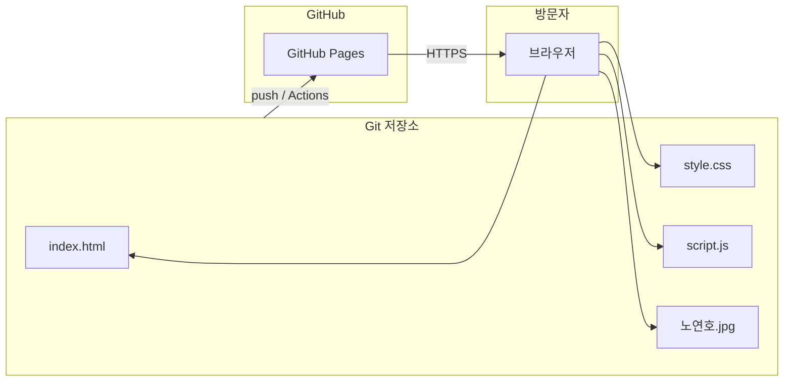
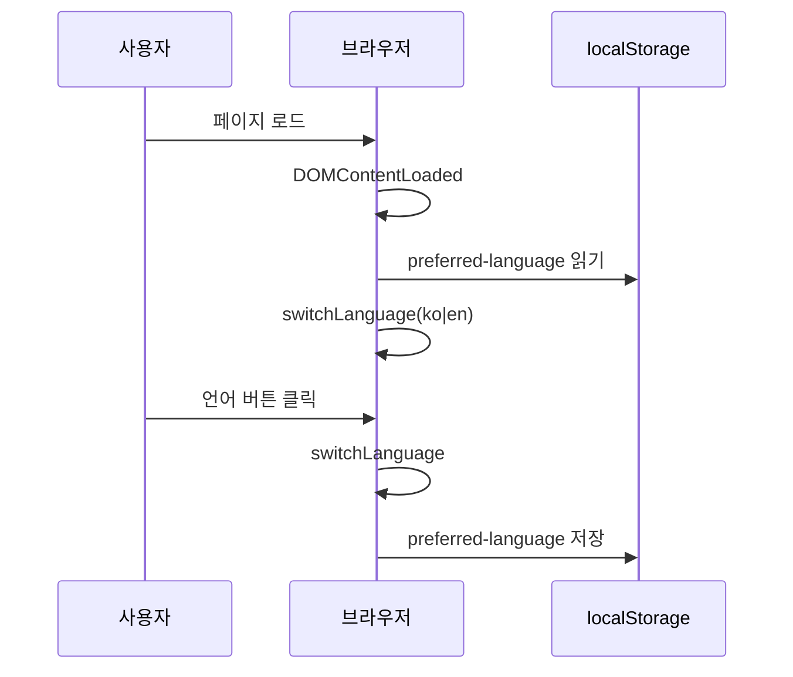

# 아키텍처 — 개인 소개 정적 사이트

## 개요

- **런타임**: 브라우저만 필요(빌드 단계 없음).
- **배포**: GitHub Pages가 저장소 루트(또는 설정된 브랜치·경로)의 정적 파일을 서빙.
- **다국어**: `script.js`의 `translations` 객체 + HTML `data-i18n` 키로 클라이언트 전환, `localStorage`에 언어 선호 저장.

## 구성 요소 다이어그램

## 요청·상태 흐름(클라이언트)

## 파일 역할

| 파일 | 책임 |
|------|------|
| `index.html` | 시맨틱 구조, 섹션, `data-i18n` 키 부착 |
| `style.css` | 테마 변수, 레이아웃, 반응형 |
| `script.js` | i18n, 탭, 스크롤 스파이, 애니메이션, 커서 효과 |

## 보안·개인정보

- 연락처(이메일, 전화)가 HTML에 노출됨. 스팸 완화가 필요하면 연락 폼을 백엔드와 연동하는 별도 아키텍처를 검토합니다.
